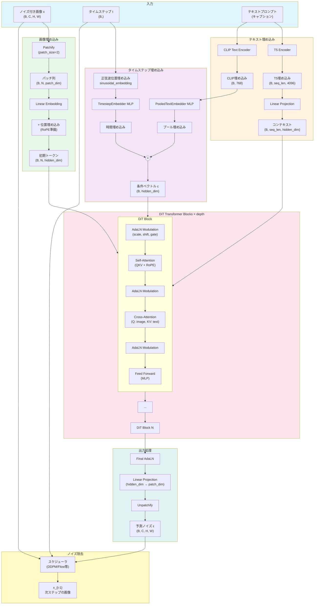

```mermaid
flowchart TB
    subgraph Input["入力"]
        X["ノイズ付き画像 x<br/>(B, C, H, W)"]
        T["タイムステップ t<br/>(B,)"]
        TEXT["テキストプロンプト<br/>(キャプション)"]
    end

    subgraph TextEmbedding["テキスト埋め込み"]
        T5["T5 Encoder"]
        CLIP["CLIP Text Encoder"]
        TEXT --> T5
        TEXT --> CLIP
        T5 --> T5_EMB["T5埋め込み<br/>(B, seq_len, 4096)"]
        CLIP --> CLIP_EMB["CLIP埋め込み<br/>(B, 768)"]
        T5_EMB --> TEXT_PROJ["Linear Projection"]
        TEXT_PROJ --> CONTEXT["コンテキスト<br/>(B, seq_len, hidden_dim)"]
    end

    subgraph TimestepEmbedding["タイムステップ埋め込み"]
        T --> SINCOS["正弦波位置埋め込み<br/>sinusoidal_embedding"]
        SINCOS --> TIME_MLP["TimestepEmbedder MLP"]
        CLIP_EMB --> POOL_MLP["PooledTextEmbedder MLP"]
        TIME_MLP --> TIME_EMB["時間埋め込み"]
        POOL_MLP --> POOL_EMB["プール埋め込み"]
        TIME_EMB --> ADD(("+"))
        POOL_EMB --> ADD
        ADD --> COND["条件ベクトル c<br/>(B, hidden_dim)"]
    end

    subgraph ImageEmbedding["画像埋め込み"]
        X --> PATCHIFY["Patchify<br/>(patch_size=2)"]
        PATCHIFY --> PATCHES["パッチ列<br/>(B, N, patch_dim)"]
        PATCHES --> X_EMB["Linear Embedding"]
        X_EMB --> POS_EMB["+ 位置埋め込み<br/>(RoPE準備)"]
        POS_EMB --> X_INIT["初期トークン<br/>(B, N, hidden_dim)"]
    end

    subgraph DiTBlocks["DiT Transformer Blocks × depth"]
        X_INIT --> BLOCK1
        CONTEXT --> BLOCK1
        COND --> BLOCK1
        
        subgraph BLOCK1["DiT Block"]
            direction TB
            ADANORM1["AdaLN Modulation<br/>(scale, shift, gate)"]
            ATTN["Self-Attention<br/>(QKV + RoPE)"]
            ADANORM2["AdaLN Modulation"]
            CROSS["Cross-Attention<br/>(Q: image, KV: text)"]
            ADANORM3["AdaLN Modulation"]
            FFN["Feed Forward<br/>(MLP)"]
            
            ADANORM1 --> ATTN
            ATTN --> ADANORM2
            ADANORM2 --> CROSS
            CROSS --> ADANORM3
            ADANORM3 --> FFN
        end
        
        BLOCK1 --> DOTS["..."]
        DOTS --> BLOCKN["DiT Block N"]
    end

    subgraph Output["出力処理"]
        BLOCKN --> FINAL_NORM["Final AdaLN"]
        FINAL_NORM --> LINEAR["Linear Projection<br/>(hidden_dim → patch_dim)"]
        LINEAR --> UNPATCH["Unpatchify"]
        UNPATCH --> NOISE_PRED["予測ノイズ ε<br/>(B, C, H, W)"]
    end

    subgraph Denoise["ノイズ除去"]
        NOISE_PRED --> SCHEDULER["スケジューラ<br/>(DDPM/Flow等)"]
        X --> SCHEDULER
        T --> SCHEDULER
        SCHEDULER --> X_PREV["x_{t-1}<br/>次ステップの画像"]
    end

    style Input fill:#e1f5fe
    style TextEmbedding fill:#fff3e0
    style TimestepEmbedding fill:#f3e5f5
    style ImageEmbedding fill:#e8f5e9
    style DiTBlocks fill:#fce4ec
    style Output fill:#e0f2f1
    style Denoise fill:#fff9c4
```